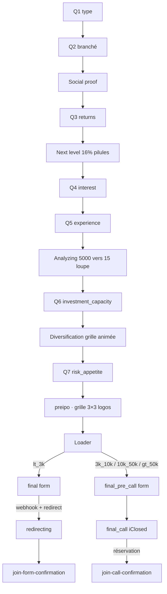

# Akka — Funnel V0 · Spécification du pilote
## État de référence (à jour du build actuel)

> Funnel d'onboarding quiz, mobile-first, plein écran. Deliverable : `akka_funnel_v0_prototype.jsx` (composant React autonome — polices, photos, icônes, SVG/logos inlinés).
> Langue du funnel : **EN**. Ce doc : **FR**.
> **En ligne (preview)** : `https://akka-onboarding.netlify.app` · Cible pilote : sous-domaine `join.akka.app`.
> ⚠️ **[CONFORMITÉ]** : chiffres de perf, social proof, témoignages, sélection « startups scanned », noms/logos d'entreprises = placeholders à sourcer/consentir/valider juridiquement avant mise en ligne (produit régulé AMF).

---

## 1. Design system

| Élément | Valeur |
|--------|--------|
| Fond | `#0D302D` + radial plus clair `#14443E` en haut |
| Accent / CTA | `#69EA9B` |
| Texte | clair `#E5FFFD` · dim `rgba(229,255,253,.62)` · faint `rgba(229,255,253,.40)` |
| Carte | fond `rgba(229,255,253,.05)` · bordure `rgba(229,255,253,.06)` · active = bordure accent |
| Dégradé gros chiffres | `linear-gradient(180deg, #CFFBE0, #69EA9B 58%, #2FA56C)` (clip texte) |
| Police titres | **PP Pangram Semibold** (inlinée) |
| Police texte | **Satoshi Variable** roman + italique (inlinées) |
| Largeur | colonne centrée, max ~508px, padding contenu 28px en haut |
| Full-page | fond vert sur `html/body` + `overscroll-behavior:none` (pas de blanc au rebond) |
| Animations | `fade-in-up` cascade ; `rise()` (opacity+translate) pour révélations ; `prefers-reduced-motion` respecté |

---

## 2. Règles UI

- **Réponses (1 ligne) :** boxes « + », icône blanche en encadré 36px, sélection = bordure accent.
- **Réponses (2 lignes — `OptionCard2`) :** icône + titre gras + sous-titre dim (Q7).
- **Tuiles logo (`preipo`) :** voir §4.13.
- **Titres de questions :** micro-typewriter `TWTitle` (sans curseur, hauteur réservée).
- **Champs formulaire :** label flottant, hauteur 58px.

---

## 3. Icônes & logos
- **Q1 :** icônes 3D de marque (PNG inlinés).
- **Réponses :** icônes ligne blanches (style Lucide), set complet inliné.
- **preipo :** 9 **logos de marque** (SVG inlinés base64), rendus en **blanc monochrome** (`filter: brightness(0) invert(1)`).

---

## 4. Funnel (écran par écran)

**FLOW (ordre interne réel) :**
`q1 → q2 → social → q3 → nextlevel → q4 → q5 → analyzing → q6 → diversification → q7 → preipo → loader → [final | final_pre_call → final_call] → redirecting → done`

### 01 · Q1 — Type d'investisseur *(intro fusionnée)*
Logo Akka, pas de progress bar. Headline « Is Akka the right fit *for you?* » / « 3 minutes to find out. » · Question « Are you mostly a… » · Tuiles 2×2 (Stock / Real estate / Crypto / Saver) → `investor_type`.

### 02 · Q2 — Ce qui les attire *(branché selon Q1)*
4 variantes (stocks / crypto / real_estate / saver), 4 réponses chacune → `investor_stocks | investor_crypto | investor_real_estate | investor_saver`.

### 03–04 · Social proof *(branché, count-up + reveal progressif)*
| `investor_type` | Chiffre | Label |
|---|---|---|
| stocks | **100%** | started as stock investors |
| crypto | **3,000+** | investors on Akka |
| real_estate | **3,000+** | investors on Akka |
| saver | **100%** | started with just a savings account |
Note « Apple · 4.8 · ★★★★★ · App Store » + témoignage par profil. **[CONFORMITÉ]** à sourcer/consentir.

### 05 · Q3 — Rendements actuels
« what are your average yearly returns? » → `returns` (No idea / <5% / 5-10% / >10%).

### 06 · Next level
Titre 2 lignes « This is what the / next level looks like » · chiffre **16%** count-up + « net per year* » · **barres verticales en pilules animées** (caps verts pleins, dégradé, progression exponentielle, sans glow). Disclaimer « *Projected performance. Not a guarantee of future results.* » · **[CONFORMITÉ]**.

### 07 · Q4 — Motivation
« what's got you curious about startup investing now? » → `interest`.

### 08 · Q5 — Expérience *(réponse + infobulle typewriter)*
3 réponses → `experience`. Infobulle « 80% of our members had never invested… » · **[CONFORMITÉ]**.

### 09 · Analyzing *(« 5000 startups »)* — id `experience_akka`
« We make it easy for you » / **EACH YEAR**. Chiffre unique monte **0 → 5 000+** (punch) puis redescend **5 000 → 15** ; label « startups scanned » (gris) → « selected for you » (vert). Loupe (`Licorn_Zoom.svg`, intrinsèque **909×909**, affichée **210px**) + étoiles (**240px**). Le **5 000+** est tenu plusieurs secondes (punch + léger glow) avant le count-down. Citation « The hard work is done. You just pick what excites you. » Informationnel. **[CONFORMITÉ]** sur la sélection.

### 10 · Q6 — Capacité d'investissement → `investment_capacity`
- **Titre :** How much are you thinking of investing? · **Sous-titre :** *Just a rough estimate.*
- **Réponses (icône) :** Less than €3,000 `circle-dot` `lt_3k` / Between €3,000 and €10,000 `layers` `3k_10k` / Between €10,000 and €50,000 `trending-up` `10k_50k` / More than €50,000 `landmark` `gt_50k`.
- **Note (au-dessus du CTA, faint, centrée) :** *No pressure, this just helps us personalize your experience.* *(plus de typewriter sous la réponse)*
- **⚠️ Détermine le branchement de fin** (§5).

### 11 · Diversification *(grille animée — séquencée comme les autres intermédiaires)*
- **Ordre :** 1) la **grille 6×6 s'anime** (10 tuiles vertes s'allument une à une, **vert vif** `#B6FFCE→#44E58E→#14C06A` + glow renforcé) → 2) le **titre apparaît** (2 lignes, fade, **sans typewriter**) → 3) le **texte** → 4) le **CTA**. Révélations en cascade (durée `.8s`, délais 0 / 0.2s / 0.4s).
- **Espacements :** plus d'air entre la grille et le titre (`marginTop 40`), resserré entre titre et texte (`8px`).
- **Titre :** You don't build a castle / with one brick · **Sous-titre :** One rule in startup investing: **spread the risk.** Aim for 10+ deals minimum.
- Informationnel. **[CONFORMITÉ]** « spread the risk / 10+ deals » = possible conseil (AMF).

### 12 · Q7 — Appétit au risque *(2 lignes + infobulle typewriter)* → `risk_appetite`
- « What kind of investments appeal to you? »

| Titre `icône` | Sous-titre | Valeur |
|---|---|---|
| Lower risk `shield` | Pre-IPO, closer to exit **(1-3 years)** | `lower_risk` |
| Higher potential `rocket` | Early-stage startups **(3-8 years)** | `higher_potential` |
| A mix of both `arrow-left-right` | Best of both worlds. | `mix` |

Infobulles : « Smart and steady… » / « Chasing unicorns. Love that. » / « Most of our top performers do exactly that. » **[CONFORMITÉ]** sur la dernière.

### 13 · preipo — Sélection d'entreprises *(grille 3×3 de logos)* → `preipo_selection` *(tableau)*
- **Question :** Which of these would you love to invest in? · **Sous-titre :** Pick the ones that excite you.
- **Grille 3×3** d'encadrés **carrés de taille égale** (`aspect-ratio 1/1`). Chaque tuile : **logo de marque** (blanc monochrome, centré) + **petite coche en bas à droite** (vide → verte cochée, façon Q1). Multi-select, Continue actif dès **≥ 1**.
- **9 logos :** Anthropic · OpenAI · Stripe · Figma · Epic Games · Revolut · Klarna · Ledger · Discord (SVG inlinés base64).
- **Homogénéité :** table `PREIPO_LOGO_FIT` (largeur/hauteur max par logo) pour équilibrer wordmarks larges et icônes carrées. Valeurs actuelles : anthropic 94%/32 · figma 72%/44 · epic_games 74%/44 · discord 92%/26 · klarna 80%/30 · revolut 74%/28 · stripe 66%/28 · (openai, ledger = défaut 82%/30).

> **[CONFORMITÉ / LÉGAL]** Logos + noms de marques tierces suggérant un investissement = représentation : vérifier l'existence réelle des deals et les droits d'usage des logos.

### Loader
« Building your investor profile… » + 3 checks. Branche selon `investment_capacity` (§5). **[CONFORMITÉ]** « risk profile ».

### 14a · final *(= final_form — chemin « lt_3k »)*
Badge « You're in the right place » · Titre « Complete your profile to receive your invitation » · champs First name / Email / **Phone** (§6) · CTA « Get my invitation » · note de risque. Soumission valide → écran **redirecting** → `https://www.akka.app/join-form-confirmation`.
**Espace progressbar → contenu réduit** (`paddingTop 4`).

### 14b · final_pre_call *(chemin €3,000+ — même base)*
Titre « Complete your profile to get started. » · CTA « Continue » · mêmes champs. Soumission valide → **final_call**. Même `paddingTop 4`.

### 15 · final_call *(prise de RDV iClosed)*
- **Titre fixe** (pas d'animation) : « You're one call away, **[First name]**. »
- Texte sur **2 lignes** : « Our memberships are invite-only. » / « This 25-min call is the final step to join. »
- **Filet de séparation** fin.
- « Pick a time that works for you » précédé d'une **icône horloge verte** (sans cercle/badge).
- **Embed iClosed** (§7). Après réservation → `https://www.akka.app/join-call-confirmation` *(config dashboard iClosed)*.

### redirecting
Transition in-app (même fond, spinner vert « Finalizing your profile… ») → redirection après ~1,1 s (sans flash).

---

## 5. Branchement de fin *(selon `investment_capacity`)*
```
loader ──▶ "lt_3k" ? final (form)        → redirecting → akka.app/join-form-confirmation
                   : final_pre_call (form) → final_call (iClosed) → akka.app/join-call-confirmation
```

---

## 6. Téléphone — `libphonenumber-js` (câblé)
Dépendance : `npm i libphonenumber-js`.
- **Liste complète de tous les pays** via `getCountries()` ; **noms** via `Intl.DisplayNames` (pas de dataset à maintenir) ; **drapeaux** via emoji dérivé du code ISO ; **indicatifs** via `getCountryCallingCode`.
- **Sélecteur custom recherchable** (`CountrySelect`) : bouton drapeau + indicatif ; panneau déroulant avec **champ de recherche** (par nom, code pays ou indicatif), liste affichant **nom du pays + indicatif**, fermeture au clic extérieur, **ombre légère**.
- Défaut **FR**, **présélection par IP** (`ipwho.is`, try/catch → FR).
- **Formatage live** (`AsYouType`), **validation** (`isValidPhoneNumber`).
- **E.164 vers iClosed & webhook** : `parsePhoneNumberFromString(form.phone, country.code).number`. Ne **jamais** envoyer `form.phone` brut (national).

---

## 7. Intégration iClosed (`final_call`)
`<div id="iclosed-widget" data-url="https://app.iclosed.io/e/akka/strategy-call-2">` + `useEffect` : collecte params (localStorage + URL + champs funnel, phone **E.164**) → mapping `iclosedName/Email/Phone` + UTM sur data-url → miroir UTM sur l'URL de page → injection unique de `widget.js`. Redirection post-réservation = **dashboard iClosed**. Invisible en localhost (normal).

---

## 8. Données collectées
`investor_type` · `investor_[type]` · `returns` · `interest` · `experience` · `investment_capacity` · `risk_appetite` · `preipo_selection` *(tableau)* · `first_name` · `email` · `phone` *(E.164)* · `country`.
**Un seul POST** final. **Premier payload COMPLET** (toutes les clés, `investor_*` incluses vides) pour figer la structure Make.

---

## 9. Stack & déploiement
| | |
|--|--|
| Build | **Vite + React 18** · dépendance `libphonenumber-js` |
| Composant | `src/AkkaFunnelV0.jsx` (default export `AkkaFunnelV0`) |
| Scaffold | `package.json` · `vite.config.js` · `index.html` · `src/main.jsx` · `netlify.toml` |
| Hébergement | **Netlify** — `https://akka-onboarding.netlify.app` |
| Cible pilote | `join.akka.app` (CNAME → `akka-onboarding.netlify.app`) |

> **⚠️ Bundle lourd (≥ ~1 Mo non-gzip).** Tout est inliné en base64 : loupe (PNG 824×1330 ≈ 290 kB), **9 logos SVG (~95 kB)**, polices, étoiles + libphonenumber-js. **À alléger avant le pilote** (sortir loupe/étoiles/**logos** en `public/`, polices `.woff2` + preload, code-split). Cible JS bien < 200 kB gzip.

---

## 10. Conformité — à régler avant mise en ligne
1. **16% net/an** (next level) → source ou reformulation.
2. **Social proof** 100% / 3 000+ / note 4.8 → justificatifs.
3. **« 80% of our members »** (Q5) → justificatif.
4. **« 5 000+ scanned / 15 selected for you »** (analyzing) → fiabiliser/adoucir.
5. **« spread the risk / 10+ deals »** (diversification) → risque de conseil (AMF).
6. **« Most of our top performers »** (Q7) → justifier/adoucir.
7. **Logos + noms pre-IPO** (preipo) → existence réelle des deals + droits d'usage des logos.
8. **Témoignages** → réels & consentis.
9. **Consentement marketing** (RGPD + AMF) sur les formulaires.
10. **Copy loader** « risk profile » à fiabiliser/adoucir.

---

## 11. Suite du pilote — étapes restantes
1. **Webhook Make** — POST `{keepalive:true}` vers `https://hook.eu2.make.com/iwotrkjtymboayre3o2kmlkk3pbmmd9d`, payload **plat & complet** (E.164, UTMs+gclid, referrer, funnel_version, submitted_at), **avant** redirection.
2. **Tracking GA4/GTM** — dataLayer : `funnel_start` + UTM / `funnel_step_view {step_index, step_id, investor_type}` / `funnel_answer {step_id, field, value}` / `generate_lead` ; `STEP_META` ; capture+persistance UTM.
3. **Allègement du bundle** (cf. §9) — recommandé avant le test (biais LCP entre variantes).
4. **Conformité** — consentement + points §10.
5. **Sous-domaine** join.akka.app + GTM/GA4 cross-domain + conversion `join-form-confirmation`, puis **Optibase** (split A/B, objectif bayésien P2BB, plan gratuit 10k/mois + 1 test).
6. **QA cross-device** + lancement + monitoring.

**Dimensionnement :** 1 000–5 000 entrées/mois → ~500–2 500/variante. Écart +5 pts détectable 1–4 sem ; +3 pts 1–2 mois. Recommandé : baseline GA4 réelle + métrique-relais + run 2–4 sem.

---

## 12. Estimation — pilote (assisté par IA)
> Jour = 560 €/j HT. Temps d'attente (DNS, accumulation A/B) non facturés.

**Déjà réalisé (build proto)** ≈ 4–4,5 j.

| Restant (mise en prod) | Est. |
|---|---:|
| Webhook Make (E.164, payload complet) | 0,5 j |
| Tracking GA4/GTM | 0,75 j |
| Allègement bundle (assets → public/, woff2, code-split) | 0,5 j |
| Conformité (consentement + ajustements) | 0,25–0,5 j |
| QA cross-device | 0,5 j |
| Sous-domaine join.akka.app | 0,25 j |
| GTM/GA4 sous-domaine + cross-domain + conversion | 0,5 j |
| Config Optibase | 0,5 j |
| Baseline + lancement | 0,5 j |
| **Total dev actif** | **≈ 4,25–4,75 j** |

**Suivi :** ~0,25 j/sem + analyse 0,5 j → **~1–1,5 j**.
**Total pilote ≈ 5,25–6,25 j (~2 940–3 500 € HT).**

---

## 13. Parké / inutilisé (réactivable)
- `MultiCard` (preipo est passé en grille de logos), composants glass/art non utilisés, écran **done** inatteignable (form + iClosed redirigent). Variantes A/B d'écrans (analyzing / next level) tranchées : une seule version conservée pour chacune.
- Tout sortir des base64 au build « propre » (Claude Code).

---

## 14. Flow

